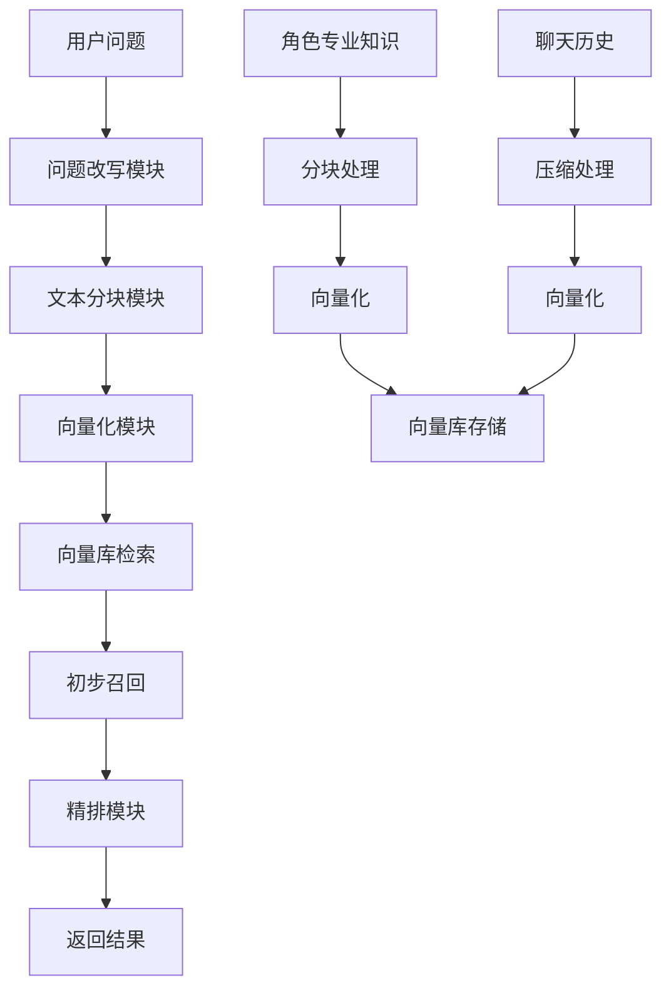

# 向量数据库技术方案

## 1. 项目现状分析

### 1.1 当前实现
- 使用 ChromaDB 作为向量数据库
- 使用 `@chroma-core/default-embed` 作为向量化工具（基于 Hugging Face）
- 实现了 `ChromaLongTermMemory` 类，提供基本的记忆添加和搜索功能
- 支持按代理 ID 隔离数据

### 1.2 存在的问题
- 依赖 Hugging Face API，可能需要付费或有速率限制
- 缺少分块处理逻辑
- 缺少精排机制
- 聊天历史记录存储和压缩机制不完善

## 2. 技术方案

### 2.1 技术选型

#### 2.1.1 向量化工具
选择以下开源向量化工具之一：

| 工具 | 优势 | 劣势 |
|------|------|------|
| **Sentence Transformers** | - 开源免费<br>- 支持多种语言模型<br>- 本地部署，无 API 调用<br>- 社区生态成熟<br>- 文档完善 | - 模型较大，首次加载慢<br>- 需要一定的计算资源 |
| **Qwen Embedding** | - 开源免费<br>- 性能优异<br>- 支持多语言<br>- 模型大小适中<br>- 字节跳动官方支持 | - 相对较新，社区生态不如 Sentence Transformers |
| **FastText** | - 轻量级<br>- 训练速度快<br>- 支持子词信息 | - 语义表达能力相对较弱 |
| **GTE (General Text Embeddings)** | - 性能优异<br>- 支持多语言<br>- 模型大小适中 | - 依赖 PyTorch |

**推荐选择：Sentence Transformers**
- 社区生态成熟，文档完善，问题解决资源丰富
- 支持多种预训练模型，可根据需求选择不同大小和性能的模型
- 本地部署，无外部依赖，避免 API 调用限制和费用
- 支持多语言，包括中文，性能稳定
- 活跃的社区维护，持续更新和改进

#### 2.1.2 分块策略
- **文本分块**：使用滑动窗口算法，基于句子边界进行分块
- **块大小**：根据模型最大输入长度动态调整（默认 256  tokens）
- **重叠比例**：10-15%，确保上下文连续性

#### 2.1.3 精排机制
- **初步召回**：使用向量相似度搜索获取 top-K 结果
- **精排算法**：结合以下因素进行加权评分：
  - 向量相似度得分
  - 时间衰减因子（越新的记忆权重越高）
  - 重要性权重
  - 与查询的语义匹配度

### 2.2 系统架构



### 2.3 数据存储设计

#### 2.3.1 集合结构
- **角色专业知识库**：
  - 集合命名格式：`role_knowledge_{role_id}`
  - 元数据包含：`role_id`、`knowledge_type`、`source`

- **聊天历史库**：
  - 集合命名格式：`chat_history_{agent_id}`
  - 元数据包含：`agent_id`、`session_id`、`compressed`、`timestamp`

#### 2.3.2 元数据设计
```typescript
interface MemoryMetadata {
  // 通用字段
  timestamp: number;        // 创建时间戳
  importance: number;       // 重要性评分 (0-1)
  
  // 角色专业知识字段
  role_id?: string;         // 角色 ID
  knowledge_type?: string;  // 知识类型 (如: 技术、历史、文化等)
  source?: string;          // 知识来源
  
  // 聊天历史字段
  agent_id?: string;        // 代理 ID
  session_id?: string;      // 会话 ID
  compressed?: boolean;     // 是否压缩
  original_length?: number; // 原始长度
  compressed_length?: number; // 压缩后长度
}
```

### 2.4 核心功能实现

#### 2.4.1 问题改写模块
```typescript
class QuestionRewriter {
  private model: any;
  
  constructor() {
    // 初始化模型
  }
  
  async rewriteQuestion(question: string): Promise<string[]> {
    // 构建提示模板
    const prompt = `你是一个查询扩展助手。请将以下用户问题改写为3个不同角度的查询，以便更好地从向量数据库中检索相关内容。

用户问题：${question}

要求：
1. 在不改变原始含义的基础上，从其他视角或立场进行重新表述
2. 采用同义词、近义词，并适当延伸与之相关的概念或语境
3. 严格按照下面标准 JSON 数组格式输出，数组中的每个元素必须是一个独立的查询字符串，且你的输出内容不得包含 JSON 结构之外的任何文字说明

输入示例：评价一下AI领域的各个研究方向？

输出示例：
[
  "AI领域有哪些主要研究方向？各自的研究内容、优缺点和发展前景如何？",
  "如何评估人工智能不同研究分支（如机器学、自然语言处理、计算机视觉等）的进展与价值？",
  "从学术、产业应用、创新特质、个人发展角度，对人工智能各领域的研究方向进行综合评述。"
]

请输出3个改写后的查询：`;
    
    // 调用模型生成改写结果
    const response = await this.model.generate(prompt);
    
    // 解析JSON响应
    try {
      const rewrites = JSON.parse(response);
      return rewrites.slice(0, 3); // 确保只返回3个改写结果
    } catch (error) {
      // 如果解析失败，返回原始问题
      return [question];
    }
  }
}
```

#### 2.4.2 文本分块模块
```typescript
class TextChunker {
  private chunkSize: number;
  private overlapSize: number;
  
  constructor(chunkSize: number = 256, overlapSize: number = 32) {
    this.chunkSize = chunkSize;
    this.overlapSize = overlapSize;
  }
  
  chunk(text: string): string[] {
    // 实现基于句子边界的滑动窗口分块
    // ...
  }
}
```

#### 2.4.3 向量化模块
```typescript
interface EmbeddingFunction {
  embed(texts: string[]): Promise<number[][]>;
}

class SentenceTransformerEmbedding implements EmbeddingFunction {
  private model: any;
  
  constructor(modelName: string = 'all-MiniLM-L6-v2') {
    // 初始化 Sentence Transformer 模型
  }
  
  async embed(texts: string[]): Promise<number[][]> {
    // 实现向量化逻辑
    // ...
  }
}
```

#### 2.4.4 精排模块
```typescript
class Reranker {
  rerank(query: string, candidates: MemoryItem[], topK: number = 5): MemoryItem[] {
    // 实现精排逻辑
    // 1. 计算每个候选的综合得分
    // 2. 按得分排序
    // 3. 返回 topK 结果
    // ...
  }
}
```

#### 2.4.5 聊天历史压缩模块
```typescript
class ChatCompressor {
  compress(chatHistory: string): string {
    // 实现聊天历史压缩逻辑
    // 如：提取关键信息、总结对话内容
    // ...
  }
}
```

#### 2.4.6 向量数据库接口
```typescript
interface VectorDatabase {
  add(embeddings: number[][], documents: string[], metadatas: any[]): Promise<void>;
  query(queryEmbedding: number[], topK: number): Promise<{documents: string[], metadatas: any[], scores: number[]}>;
  delete(ids: string[]): Promise<void>;
  count(): Promise<number>;
}

class ChromaVectorDatabase implements VectorDatabase {
  // 实现 ChromaDB 操作
  // ...
}
```

### 2.5 集成方案

#### 2.5.1 记忆管理服务
```typescript
class MemoryManager {
  private vectorDB: VectorDatabase;
  private chunker: TextChunker;
  private embedder: SentenceTransformerEmbedding;
  private reranker: Reranker;
  private compressor: ChatCompressor;
  private rewriter: QuestionRewriter;
  
  constructor() {
    this.embedder = new SentenceTransformerEmbedding();
    this.rewriter = new QuestionRewriter();
    // 初始化其他模块
  }
  
  // 添加角色专业知识
  async addRoleKnowledge(roleId: string, knowledge: string, knowledgeType: string): Promise<void> {
    // 分块 → 向量化 → 存储
  }
  
  // 添加聊天历史
  async addChatHistory(agentId: string, sessionId: string, chatHistory: string): Promise<void> {
    // 压缩 → 分块 → 向量化 → 存储
  }
  
  // 检索相关记忆
  async retrieveRelevantMemories(query: string, topK: number = 5): Promise<MemoryItem[]> {
    // 1. 问题改写
    const rewrittenQueries = await this.rewriter.rewriteQuestion(query);
    
    // 2. 向量化所有查询
    const queryEmbeddings = await this.embedder.embed(rewrittenQueries);
    
    // 3. 检索所有查询的结果
    const allResults: MemoryItem[] = [];
    for (const embedding of queryEmbeddings) {
      const results = await this.vectorDB.query(embedding, topK);
      // 转换结果为 MemoryItem
      // ...
      allResults.push(...results);
    }
    
    // 4. 去重
    const uniqueResults = this.deduplicateResults(allResults);
    
    // 5. 精排
    return this.reranker.rerank(query, uniqueResults, topK);
  }
  
  // 结果去重
  private deduplicateResults(results: MemoryItem[]): MemoryItem[] {
    const seen = new Set<string>();
    return results.filter(item => {
      const key = item.content.trim();
      if (seen.has(key)) {
        return false;
      }
      seen.add(key);
      return true;
    });
  }
}
```

#### 2.5.2 API 接口
```typescript
// 添加角色知识
app.post('/api/memory/role-knowledge', async (req, res) => {
  // 处理请求
});

// 添加聊天历史
app.post('/api/memory/chat-history', async (req, res) => {
  // 处理请求
});

// 检索记忆
app.post('/api/memory/retrieve', async (req, res) => {
  // 处理请求
});
```

## 3. 实施计划

### 3.1 阶段一：基础架构搭建
1. 安装 Sentence Transformers 依赖
2. 实现 EmbeddingFunction 接口和 SentenceTransformerEmbedding 实现
3. 实现 TextChunker 模块
4. 实现 QuestionRewriter 模块
5. 实现 VectorDatabase 接口和 ChromaVectorDatabase 实现

### 3.2 阶段二：核心功能实现
1. 实现 ChatCompressor 模块
2. 实现 Reranker 模块
3. 实现 MemoryManager 类
4. 集成各模块，构建完整的记忆管理系统

### 3.3 阶段三：API 接口和测试
1. 实现 REST API 接口
2. 编写单元测试和集成测试
3. 性能测试和优化
4. 文档编写

## 4. 预期效果

### 4.1 技术指标
- **向量化速度**：本地处理，响应时间 < 100ms
- **检索准确率**：Top-1 准确率 > 85%
- **存储效率**：聊天历史压缩率 > 50%
- **扩展性**：支持水平扩展，可处理大规模知识库

### 4.2 业务价值
- 降低对外部 API 的依赖，减少成本
- 提高记忆检索的准确性和相关性
- 支持多角色知识隔离，提升系统安全性
- 优化聊天历史存储，节省存储空间

## 5. 风险评估

### 5.1 潜在风险
- **计算资源需求**：Sentence Transformers 模型需要一定的内存和计算资源
- **模型选择**：不同模型的性能和资源需求差异较大
- **数据一致性**：多角色并发操作可能导致数据一致性问题

### 5.2 风险缓解措施
- **模型优化**：选择适合部署环境的模型，如小型模型 for 边缘设备
- **缓存机制**：实现向量化结果缓存，减少重复计算
- **事务处理**：确保数据操作的原子性
- **监控系统**：建立监控机制，及时发现和解决问题

## 6. 结论

本技术方案通过替换 Hugging Face 向量化工具为开源的 Sentence Transformers，实现了本地向量化处理，降低了外部依赖。同时，通过引入分块、精排和压缩机制，提高了系统的性能和存储效率。该方案支持多角色知识隔离和聊天历史管理，为智能代理系统提供了更加可靠和高效的记忆管理能力。