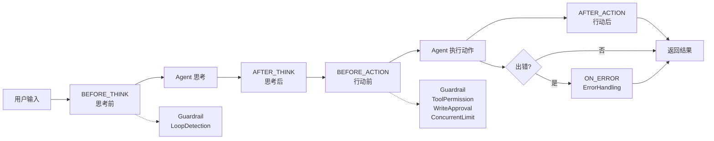
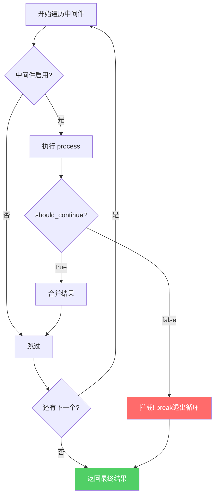

# 04 - 中间件系统（Middleware System）

> **一句话总结**：中间件是 AI Agent 的"安检关卡"，在思考、行动的每个阶段进行安全检查和流程控制。

---

## 📚 小白通俗解释

### 生活类比：机场安检

想象你要坐飞机出国，整个流程有多个**安检关卡**：

```
[值机] → [证件检查] → [行李安检] → [人身检查] → [登机]
              ↑            ↑           ↑
         中间件1       中间件2      中间件3
```

每个关卡都有不同的职责：
- **证件检查**：确认你有合法身份
- **行李安检**：扫描是否有危险物品
- **人身检查**：金属探测器、人工搜身

赛博小镇的**中间件系统**就是这套"安检机制"，但检查的对象是 **AI Agent 的每次思考和行动**：

| 安检关卡 | 对应中间件 | 检查什么 |
|---------|-----------|---------|
| 证件检查 | GuardrailMiddleware | 输入是否含危险内容（路径遍历、黑名单词） |
| 行李安检 | ToolPermissionMiddleware | 工具调用是否有权限 |
| 贵重物品申报 | WriteOperationApprovalMiddleware | 写操作是否需要审批 |
| 循环行为检测 | LoopDetectionMiddleware | Agent 是否陷入死循环 |
| 并发控制 | ConcurrentLimitMiddleware | 同时执行的任务是否超限 |
| 错误处理 | ErrorHandlingMiddleware | 出错了怎么兜底 |

---

## 🏗️ 架构总览

### 文件结构

```
src/AI/middleware/
├── base.ts                    # 基础类 + 管理器（核心）
├── dangling_action.ts         # 悬挂动作检测
├── guardrail.ts               # 安全护栏（输入输出过滤）
├── memory_summarization.ts    # 记忆摘要
├── concurrent_limit.ts        # 并发限制
├── loop_detection.ts          # 循环检测
├── clarification.ts           # 澄清请求
├── error_handling.ts          # 错误处理
├── tool_permission.ts         # 工具权限校验
├── write_approval.ts          # 写操作审批
├── factory.ts                 # 安全中间件工厂
└── index.ts                   # 统一导出
```

### 执行阶段



---

## 🔧 核心代码讲解

### 1. 基础定义 (`base.ts`)

#### 1.1 中间件阶段枚举

```typescript
// src/AI/middleware/base.ts:5-11
export enum MiddlewarePhase {
  BEFORE_THINK = "before_think",   // Agent 开始思考之前
  AFTER_THINK = "after_think",     // Agent 思考完成之后
  BEFORE_ACTION = "before_action", // Agent 准备执行工具之前
  AFTER_ACTION = "after_action",   // Agent 执行完工具之后
  ON_ERROR = "on_error"            // 发生错误时
}
```

**解释**：
- `BEFORE_THINK`：类似"进入机场大厅前"——检查用户输入是否安全
- `AFTER_THINK`：类似"通过安检后"——检查 Agent 的思考结果是否合理
- `BEFORE_ACTION`：类似"登机前最后一关"——最关键的检查，防止危险操作
- `ON_ERROR`：类似"航班延误处理"——出问题时的应急预案

#### 1.2 中间件上下文接口

```typescript
// src/AI/middleware/base.ts:17-28
export interface MiddlewareContext {
  agent_id: string;           // 智能体ID（如 "agent_001"）
  agent_name: string;         // 智能体名称（如 "小明"）
  phase: MiddlewarePhase;     // 当前处于哪个阶段
  current_state: string;      // 当前状态（如 "idle", "working"）
  current_location: string;   // 当前位置
  goal?: string;              // 目标（可选）
  action?: string;            // 要执行的动作（可选，如 "write_file('test.txt', ...)"）
  action_result?: string;     // 动作结果（可选）
  error?: Error;              // 错误对象（可选）
  metadata: Record<string, any>; // 额外元数据
}
```

**解释**：这是每个中间件收到的"安检通行证"，包含当前的所有上下文信息。

#### 1.3 中间件结果接口

```typescript
// src/AI/middleware/base.ts:34-40
export interface MiddlewareResult {
  should_continue: boolean;   // 是否放行（true=继续, false=拦截）
  modified_action?: string;   // 可以修改动作内容
  modified_goal?: string;     // 可以修改目标
  message?: string;           // 给用户的提示消息
  metadata: Record<string, any>; // 额外信息
}
```

**关键**：`should_continue` 是最重要的字段——返回 `false` 就意味着**拦截！**

#### 1.4 BaseMiddleware 基类

```typescript
// src/AI/middleware/base.ts:46-97
export class BaseMiddleware {
  protected name: string;     // 中间件名称
  protected enabled: boolean;  // 是否启用

  constructor(name: string) {
    this.name = name;
    this.enabled = true;
  }

  // 子类必须实现此方法
  process(context: MiddlewareContext, agent: any): MiddlewareResult {
    throw new Error("Subclasses must implement process()");
  }

  enable(): void { this.enabled = true; }   // 启用
  disable(): void { this.enabled = false; }  // 禁用
  
  get isEnabled(): boolean { return this.enabled; }
  get Name(): string { return this.name; }
}
```

**设计模式**：这是典型的**模板方法模式**——基类定义骨架，子类实现具体逻辑。

#### 1.5 MiddlewareManager 管理器

```typescript
// src/AI/middleware/base.ts:103-229
export class MiddlewareManager {
  private middlewares: BaseMiddleware[];  // 中间件列表
  private stats: Record<string, number>;  // 统计信息

  constructor() {
    this.middlewares = [];
    this.stats = {
      total_processed: 0,      // 总处理次数
      total_blocked: 0,        // 总拦截次数
      total_errors: 0,         // 总错误次数
      total_summarizations: 0, // 总结次数
      total_loop_detections: 0 // 循环检测次数
    };
  }

  // 添加中间件
  addMiddleware(middleware: BaseMiddleware): void {
    this.middlewares.push(middleware);
  }

  // 核心方法：按顺序执行所有中间件
  process(context: MiddlewareContext, agent: any): MiddlewareResult {
    this.stats.total_processed++;
    
    const finalResult: MiddlewareResult = {
      should_continue: true,
      metadata: {}
    };

    for (const middleware of this.middlewares) {
      if (!middleware.isEnabled) continue;  // 跳过禁用的中间件
      
      try {
        const result = middleware.process(context, agent);
        
        // 合并消息
        if (result.message) {
          finalResult.message = finalResult.message 
            ? finalResult.message + "\n" + result.message 
            : result.message;
        }

        // 如果被拦截，立即停止后续中间件
        if (!result.should_continue) {
          this.stats.total_blocked++;
          finalResult.should_continue = false;
          break;  // 关键：一个不通过，全部终止
        }

        // 处理修改后的行动/目标
        if (result.modified_action) {
          finalResult.modified_action = result.modified_action;
        }
        if (result.modified_goal) {
          finalResult.modified_goal = result.modified_goal;
        }
        
        // 统计
        if (middleware.Name.includes("Summarization")) {
          this.stats.total_summarizations++;
        } else if (middleware.Name.includes("Loop")) {
          this.stats.total_loop_detections++;
        }
        
      } catch (e) {
        this.stats.total_errors++;
        console.error(`中间件 ${middleware.Name} 执行错误:`, e);
      }
    }

    return finalResult;
  }
  
  getStats(): Record<string, number> { return { ...this.stats }; }
  enableAll(): void { /* 启用所有 */ }
  disableAll(): void { /* 禁用所有 */ }
}
```

**执行流程图**：



---

### 2. 具体中间件详解

#### 2.1 GuardrailMiddleware — 安全护栏 ⭐ 最重要

```typescript
// src/AI/middleware/guardrail.ts
export class GuardrailMiddleware extends BaseMiddleware {
  private config: SecurityConfig;
  private logger: SecurityLogger;

  constructor() {
    super("GuardrailMiddleware");
    this.config = new SecurityConfig();
    this.logger = new SecurityLogger();
  }

  process(context: MiddlewareContext, agent: any): MiddlewareResult {
    // ===== 第一层：输入检测 =====
    if (context.action) {
      // 1a. 路径遍历攻击检测
      if (this._detectPathTraversal(context.action)) {
        return {
          should_continue: false,
          message: "安全警告：检测到路径遍历攻击",
          metadata: { blocked: true, reason: "path_traversal" }
        };
      }

      // 1b. 黑名单输入检测
      if (this._detectBlacklistedInput(context.action)) {
        return {
          should_continue: false,
          message: "安全警告：检测到危险操作",
          metadata: { blocked: true, reason: "blacklisted_input" }
        };
      }
    }

    // ===== 第二层：输出过滤 =====
    if (context.action_result) {
      const filteredResult = this._filterBlacklistedOutput(context.action_result);
      if (filteredResult !== context.action_result) {
        return {
          should_continue: true,
          modified_action: context.action,  // 使用过滤后的结果
          metadata: { filtered: true }
        };
      }
    }

    return { should_continue: true, metadata: {} };
  }
}
```

**路径遍历检测**：

```typescript
// src/AI/middleware/guardrail.ts:54-65
private _detectPathTraversal(input: string): boolean {
  const pathTraversalPatterns = [
    /\.\.\//g,        // Unix: ../
    /\.\.\\/g,       // Windows: ..\
    /\/\.\./g,       // /..
    /\\\.\./g,       // \..
    /%2e%2e%2f/i,   // URL编码: %2e%2e%2f
    /%2e%2e%5c/i,   // URL编码Windows: %2e%2e%5c
  ];
  return pathTraversalPatterns.some(pattern => pattern.test(input));
}
```

**攻击示例**：
```
正常请求: read_file("config.json")
恶意请求: read_file("../../../etc/passwd")  ← 路径遍历!
恶意请求: read_file("..\\..\\windows\\system32")  ← Windows版本!
```

**黑名单检测**：

```typescript
// src/AI/middleware/guardrail.ts:67-78
private _detectBlacklistedInput(input: string): boolean {
  const blacklistedPatterns = this.config.getInputBlacklist();
  return blacklistedPatterns.some(pattern => {
    try {
      return new RegExp(pattern).test(input);  // 正则匹配
    } catch (error) {
      // 正则无效时降级为字符串包含检查
      return input.includes(pattern.replace(/[.*+?^${}()|[\]\\]/g, ''));
    }
  });
}
```

**输出过滤**（脱敏）：

```typescript
// src/AI/middleware/guardrail.ts:80-89
private _filterBlacklistedOutput(output: string): string {
  let filtered = output;
  const blacklistedPatterns = this.config.getOutputBlacklist();
  
  blacklistedPatterns.forEach(pattern => {
    filtered = filtered.replace(new RegExp(pattern, 'g'), '[REDACTED]');
    // 例如：手机号 13812345678 → [REDACTED]
  });
  
  return filtered;
}
```

---

#### 2.2 LoopDetectionMiddleware — 循环检测 ⭐ 防死循环神器

```typescript
// src/AI/middleware/loop_detection.ts
export class LoopDetectionMiddleware extends BaseMiddleware {
  private recentActions: Map<string, string[]>;  // 按 agent_id 分组的动作历史
  private maxHistory: number = 10;                // 最大历史长度
  private consecutiveThreshold: number = 3;       // 连续重复阈值

  process(context: MiddlewareContext, agent: any): MiddlewareResult {
    if (!context.action) {
      return { should_continue: true, metadata: {} };  // 无动作，直接放行
    }

    const agentId = context.agent_id || 'unknown';
    
    // 初始化该 agent 的历史记录
    if (!this.recentActions.has(agentId)) {
      this.recentActions.set(agentId, []);
    }
    const actions = this.recentActions.get(agentId)!;

    // 从后往前数连续相同动作的次数
    let consecutiveCount = 0;
    for (let i = actions.length - 1; i >= 0; i--) {
      if (actions[i] === context.action) {
        consecutiveCount++;  // 相同，计数+1
      } else {
        break;  // 不同，停止计数
      }
    }
    
    // 超过阈值 → 检测到循环！
    if (consecutiveCount >= this.consecutiveThreshold) {
      console.warn(`智能体 ${agentId} 连续 ${consecutiveCount} 次执行相同动作`);
      return {
        should_continue: false,
        message: "检测到循环动作，已停止执行",
        metadata: {
          loop_detected: true,
          action: context.action,
          consecutive_count: consecutiveCount
        }
      };
    }

    // 记录这次动作
    actions.push(context.action);
    if (actions.length > this.maxHistory) {
      actions.shift();  // 超长则移除最早的记录（FIFO队列）
    }

    return { should_continue: true, metadata: {} };
  }
}
```

**工作原理示意**：

```
时间线:  t1    t2    t3    t4    t5    t6
动作:  [read][write][read][read][read][read] ← 连续3次read!
历史:   [r]   [r,w] [r,w,r][w,r,r][r,r,r] ← 第4次read触发!

consecutiveCount = 3 ≥ threshold(3) → 拦截!
```

**配置参数**：
| 参数 | 默认值 | 说明 |
|------|--------|------|
| `maxHistory` | 10 | 保留最近多少条动作记录 |
| `consecutiveThreshold` | 3 | 连续相同动作多少次算循环 |

---

#### 2.3 ConcurrentLimitMiddleware — 并发控制

```typescript
// src/AI/middleware/concurrent_limit.ts
export class ConcurrentLimitMiddleware extends BaseMiddleware {
  private maxConcurrent: number = 3;   // 最大并发数
  private currentConcurrent: number = 0; // 当前并发数

  constructor(maxConcurrent: number = 3) {
    super("ConcurrentLimitMiddleware");
    this.maxConcurrent = maxConcurrent;
  }

  process(context: MiddlewareContext, agent: any): MiddlewareResult {
    if (this.currentConcurrent >= this.maxConcurrent) {
      // 已满载，拒绝新任务
      return {
        should_continue: false,
        message: "并发任务数已达到上限，请稍后再试",
        metadata: {}
      };
    }

    // 通过检查，占用一个并发位
    this.currentConcurrent++;
    return { should_continue: true, metadata: {} };
  }

  release(): void {
    if (this.currentConcurrent > 0) {
      this.currentConcurrent--;
    }
  }
}
```

**使用注意**：任务完成后必须调用 `release()` 释放资源！

---

#### 2.4 ToolPermissionMiddleware — 工具权限校验

```typescript
// src/AI/middleware/tool_permission.ts
export class ToolPermissionMiddleware extends BaseMiddleware {
  private config: SecurityConfig;

  process(context: MiddlewareContext, agent: any): MiddlewareResult {
    if (!context.action) {
      return { should_continue: true, metadata: {} };
    }

    // 解析工具调用: "write_file(path, content)" → {name:"write_file", args:"path, content"}
    const toolCall = this._parseToolCall(context.action);
    if (!toolCall) {
      return { should_continue: true, metadata: {} };  // 不是工具调用，放行
    }

    // 检查权限
    if (!this._checkToolPermission(toolCall.name, toolCall.args)) {
      return {
        should_continue: false,
        message: `安全警告：工具 ${toolCall.name} 无权限执行`,
        metadata: { blocked: true, reason: "permission_denied" }
      };
    }

    return { should_continue: true, metadata: {} };
  }

  private _parseToolCall(action: string): { name: string; args: any } | null {
    const match = action.match(/(\w+)\((.*)\)/);  // 正则提取函数名和参数
    if (match) {
      return { name: match[1], args: match[2] };
    }
    return null;
  }

  private _checkToolPermission(toolName: string, args: any): boolean {
    const toolPermissions = this.config.getToolPermissions();
    const permission = toolPermissions[toolName];
    if (!permission) return false;  // 未配置权限 = 无权
    return permission.enabled;       // 检查 enabled 标志
  }
}
```

**解析逻辑**：

```
输入: "write_file('/tmp/test.txt', 'hello world')"
正则: /(\w+)\((.*)\)/
匹配:
  group[1] = "write_file"     ← 工具名
  group[2] = "'/tmp/test.txt', 'hello world'"  ← 参数字符串
```

---

#### 2.5 WriteOperationApprovalMiddleware — 写操作审批

```typescript
// src/AI/middleware/write_approval.ts
export class WriteOperationApprovalMiddleware extends BaseMiddleware {
  private approvalRequests: Map<string, ApprovalRequest>;

  process(context: MiddlewareContext, agent: any): MiddlewareResult {
    if (!context.action) return { should_continue: true, metadata: {} };

    const toolCall = this._parseToolCall(context.action);
    if (!toolCall) return { should_continue: true, metadata: {} };

    // 判断是否为写操作
    if (this._isWriteOperation(toolCall.name)) {
      const requestId = this._generateRequestId();
      
      // 创建审批请求
      const request: ApprovalRequest = {
        id: requestId,
        tool: toolCall.name,
        args: toolCall.args,
        agentId: context.agent_id,
        status: 'pending',
        createdAt: new Date()
      };
      this.approvalRequests.set(requestId, request);

      // 模拟审批（当前默认通过）
      const approved = this._simulateApproval(request);

      if (approved) {
        return { should_continue: true, metadata: { approved: true, request_id: requestId } };
      } else {
        return {
          should_continue: false,
          message: "安全警告：写操作未获得批准",
          metadata: { blocked: true, reason: "approval_denied", request_id: requestId }
        };
      }
    }

    return { should_continue: true, metadata: {} };
  }

  private _isWriteOperation(toolName: string): boolean {
    const writeTools = this.config.getWriteTools();  // 如 ["write_file", "delete_file"]
    return writeTools.includes(toolName);
  }

  private _generateRequestId(): string {
    return `req_${Date.now()}_${Math.random().toString(36).substr(2, 9)}`;
    // 示例: "req_1704067200000_a1b2c3d4e"
  }

  private _simulateApproval(request: ApprovalRequest): boolean {
    return true;  // 当前自动通过，实际可接入人工审批
  }
}

interface ApprovalRequest {
  id: string;
  tool: string;
  args: any;
  agentId: string;
  status: 'pending' | 'approved' | 'denied';
  createdAt: Date;
}
```

---

#### 2.6 ErrorHandlingMiddleware — 错误处理

```typescript
// src/AI/middleware/error_handling.ts
export class ErrorHandlingMiddleware extends BaseMiddleware {
  process(context: MiddlewareContext, agent: any): MiddlewareResult {
    // 只在 ON_ERROR 阶段且存在错误对象时生效
    if (context.phase === MiddlewarePhase.ON_ERROR && context.error) {
      console.error(`[ErrorHandling] 处理错误: ${context.error.message}`);
      return {
        should_continue: true,  // 错误处理后仍继续（不中断流程）
        message: `发生错误: ${context.error.message}`,
        metadata: { error: context.error.message }
      };
    }
    return { should_continue: true, metadata: {} };
  }
}
```

---

#### 2.7 其他中间件（预留扩展）

以下中间件目前为**空实现**，保留接口供未来扩展：

| 中间件 | 文件 | 用途 | 当前状态 |
|--------|------|------|----------|
| DanglingActionMiddleware | `dangling_action.ts` | 检测未完成的工具调用 | 预留 |
| MemorySummarizationMiddleware | `memory_summarization.ts` | 自动压缩过长记忆 | 预留 |
| ClarificationMiddleware | `clarification.ts` | 模糊输入澄清确认 | 预留 |

---

### 3. Factory 工厂模式

```typescript
// src/AI/middleware/factory.ts
import { MiddlewareManager } from './base';
import { GuardrailMiddleware } from './guardrail';
import { ToolPermissionMiddleware } from './tool_permission';
import { WriteOperationApprovalMiddleware } from './write_approval';

// 创建预配置的安全中间件管理器
export function createSecurityMiddlewareManager(): MiddlewareManager {
  const manager = new MiddlewareManager();
  
  // 按顺序添加三个安全相关中间件
  manager.addMiddleware(new GuardrailMiddleware());           // 1. 输入输出过滤
  manager.addMiddleware(new ToolPermissionMiddleware());       // 2. 工具权限
  manager.addMiddleware(new WriteOperationApprovalMiddleware()); // 3. 写操作审批
  
  return manager;
}
```

**为什么需要工厂？**
- 统一创建标准化的中间件组合
- 保证中间件的注册顺序正确
- 方便测试和替换

---

## 📖 完整使用示例

### 示例1：基本使用

```typescript
import { 
  MiddlewareManager, 
  LoopDetectionMiddleware, 
  GuardrailMiddleware,
  MiddlewarePhase,
  type MiddlewareContext 
} from './middleware';

// 1. 创建管理器
const manager = new MiddlewareManager();

// 2. 添加中间件（顺序很重要！）
manager.addMiddleware(new LoopDetectionMiddleware(10, 3));  // 最多记10条，连复3次拦截
manager.addMiddleware(new GuardrailMiddleware());

// 3. 构建上下文
const context: MiddlewareContext = {
  agent_id: "agent_001",
  agent_name: "小红",
  phase: MiddlewarePhase.BEFORE_ACTION,
  current_state: "working",
  current_location: "home",
  action: "read_file('data/config.json')",  // 要执行的动作
  metadata: {}
};

// 4. 执行中间件
const result = manager.process(context, {});

if (result.should_continue) {
  console.log("✅ 放行，可以执行动作");
  if (result.modified_action) {
    console.log("动作被修改为:", result.modified_action);
  }
} else {
  console.log("❌ 被拦截:", result.message);
}
```

### 示例2：自定义中间件

```typescript
import { BaseMiddleware, MiddlewareContext, MiddlewareResult } from './base';

// 自定义：敏感时间段限制（夜间禁止写操作）
class NightModeMiddleware extends BaseMiddleware {
  constructor() {
    super("NightModeMiddleware");
  }

  process(context: MiddlewareContext, agent: any): MiddlewareResult {
    const hour = new Date().getHours();
    
    // 晚上11点到早上6点
    if (hour >= 23 || hour < 6) {
      if (context.action?.includes('write') || context.action?.includes('delete')) {
        return {
          should_continue: false,
          message: "🌙 夜间模式：写操作已暂停（23:00-06:00）",
          metadata: { night_mode: true }
        };
      }
    }
    
    return { should_continue: true, metadata: {} };
  }
}

// 使用
manager.addMiddleware(new NightModeMiddleware());
```

### 示例3：查看统计信息

```typescript
// 执行一系列操作后...
const stats = manager.getStats();
console.log("=== 中间件统计 ===");
console.log(`总处理次数: ${stats.total_processed}`);
console.log(`总拦截次数: ${stats.total_blocked}`);
console.log(`循环检测次数: ${stats.total_loop_detections}`);
console.log(`错误次数: ${stats.total_errors}`);
```

---

## ❓ 常见问题 FAQ

### Q1: 中间件执行的顺序重要吗？

**非常重要！** 不同的顺序可能导致不同的结果：

```
推荐顺序: LoopDetection → Guardrail → ToolPermission → WriteApproval
原因: 
  1. 先检测循环（避免浪费资源做其他检查）
  2. 再做通用安全过滤
  3. 最后做细粒度权限和审批
```

### Q2: 一个中间件返回 `should_continue: false`，后面的还执行吗？

**不执行！** `MiddlewareManager.process()` 在遇到第一个 `false` 时会立即 `break` 退出循环。这就是"一票否决制"。

### Q3: 如何临时禁用某个中间件？

```typescript
const loopDetector = new LoopDetectionMiddleware();
manager.addMiddleware(loopDetector);

// 临时禁用
loopDetector.disable();   // isEnabled = false

// 后续启用
loopDetector.enable();    // isEnabled = true
```

### Q4: 中间件会影响性能吗？

影响很小：
- 每个中间件的 `process()` 方法应该快速执行
- 被禁用的中间件会被跳过（只判断 `isEnabled`）
- `LoopDetectionMiddleware` 使用 Map + 数组，时间复杂度 O(n)，n 默认最大为 10

### Q5: `modified_action` 是怎么传递的？

当一个中间件修改了 `action`，这个修改后的值会存入 `finalResult.modified_action`。**但是**，当前架构中上下文的 `action` 字段本身不会被自动更新。如果需要让后续中间件看到修改后的动作，需要在业务层手动处理。

---

## 📝 记忆卡片（知识点总结）

```
┌─────────────────────────────────────────────────────────────┐
│                  中间件系统 · 核心速查表                       │
├─────────────────────────────────────────────────────────────┤
│  5个执行阶段:                                                │
│    BEFORE_THINK → THINK → AFTER_THINK → BEFORE_ACTION →    │
│    ACTION → AFTER_ACTION → (异常时→ON_ERROR)                 │
│                                                             │
│  3个核心安全中间件:                                          │
│    GuardrailMiddleware      输入黑名单+输出脱敏               │
│    ToolPermissionMiddleware 工具级权限控制                     │
│    WriteApprovalMiddleware  写操作审批                        │
│                                                             │
│  3个流程控制中间件:                                          │
│    LoopDetectionMiddleware 连续重复检测(防死循环)             │
│    ConcurrentLimitMiddleware 并发数限制                      │
│    ErrorHandlingMiddleware  错误捕获兜底                     │
│                                                             │
│  关键规则:                                                   │
│    ✓ 一票否决: should_continue=false 立即终止                │
│    ✓ 顺序依赖: 先通用检查，后精细控制                         │
│    ✓ 可插拔: enable()/disable() 动态开关                     │
│                                                             │
│  工厂函数: createSecurityMiddlewareManager()                 │
└─────────────────────────────────────────────────────────────┘
```

---

## 🔗 相关文档

- **下一步阅读**: [05_技能系统](05_技能系统.md) — 了解 Agent 的能力扩展机制
- **关联模块**: [09_Hooks系统与安全系统](09_Hooks系统与安全系统.md) — 另一种钩子机制
- **配置文件**: `middleware_config.yaml` — 中间件的 YAML 配置
