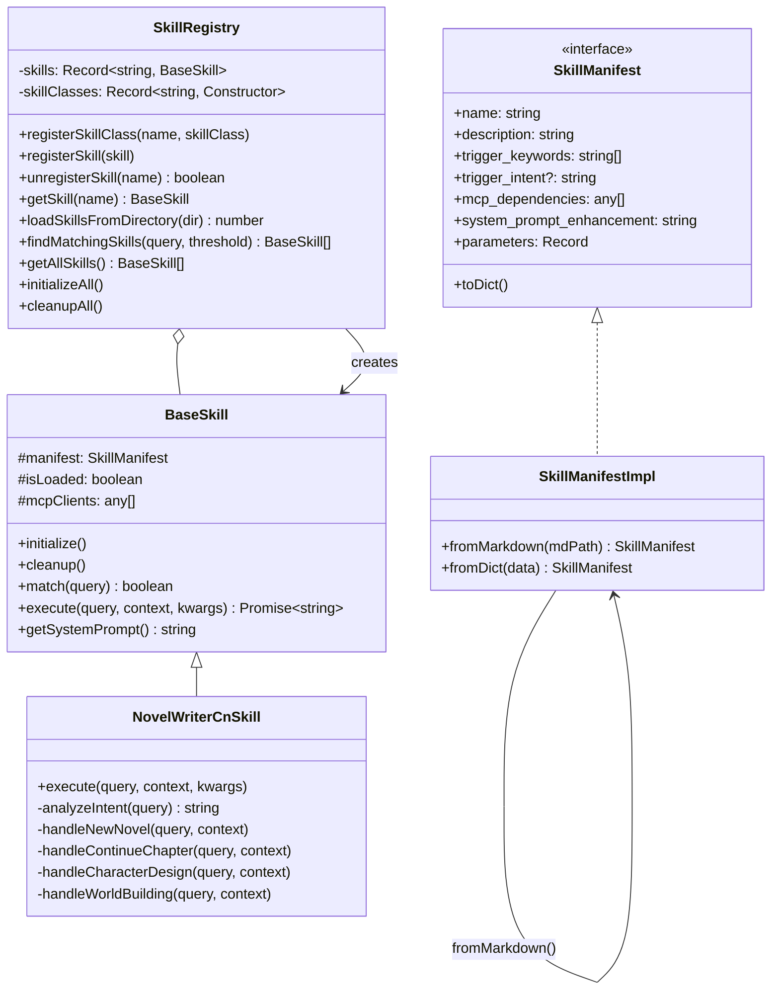

# 05 - 技能系统（Skill System）

> **一句话总结**：技能系统是 AI Agent 的"职业技能包"，让它像 RPG 游戏角色一样学会不同专业能力。

---

## 📚 小白通俗解释

### 生活类比：职业资格认证

想象一个人可以考取各种**职业资格证书**：

```
你 (AI Agent)
├── 📝 创意写作证 → 可以写小说、诗歌
├── 🔍 健康咨询证 → 可以提供医疗建议
├── 💻 代码审查证 → 可以 review 代码
├── 👨‍🏫 教学资格证 → 可以解答学习问题
└── 🌐 网络搜索证 → 可以搜索实时信息
```

每本证书都包含：
- **证书名称**：这个技能叫什么
- **适用场景**：什么时候使用这个技能
- **关键词**：哪些话会触发激活
- **专业知识**：使用时的专业提示增强

赛博小镇的**技能系统**就是这套机制——让同一个 AI Agent 根据**用户的不同需求**，动态切换到对应的专业模式。

---

## 🏗️ 架构总览

### 文件结构

```
src/AI/skills/
├── index.ts                    # 模块导出入口
├── skill_system.ts             # ★ 核心系统（接口/基类/注册表/工厂）
├── web_search/
│   └── SKILL.md               # 网络搜索技能定义
└── write/
    ├── novel-writer-cn/
    │   ├── SKILL.md           # 小说写作技能定义（263行完整指南）
    │   └── index.ts           # ★ 小说写作技能实现（295行）
    ├── chinese-writing/
    ├── inkos-multi-agent-novel-writing/
    └── write-xiaohongshu/
```

### 核心组件关系



---

## 🔧 核心代码讲解

### 1. SkillManifest 接口 — 技能"身份证"

```typescript
// src/AI/skills/skill_system.ts:12-21
export interface SkillManifest {
  name: string;                // 技能名称（唯一标识）
  description: string;         // 技能描述（用于语义匹配）
  trigger_keywords: string[];  // 触发关键词数组
  trigger_intent?: string;     // 触发意图标识（可选）
  mcp_dependencies: any[];     // 需要加载的 MCP 服务列表
  system_prompt_enhancement: string; // 系统提示增强文本
  parameters: Record<string, any>; // 技能参数
  toDict(): Record<string, any>; // 序列化为字典
}
```

**各字段含义**：

| 字段 | 类型 | 必填 | 说明 | 示例 |
|------|------|------|------|------|
| `name` | string | ✅ | 技能唯一ID | `"novel-writer-cn"` |
| `description` | string | ✅ | 自然语言描述 | `"小说创作助手，支持从零开始创作..."` |
| `trigger_keywords` | string[] | ✅ | 用户说这些词时触发 | `["写小说", "创作", "续写"]` |
| `trigger_intent` | string | ❌ | 意图分类标签 | `"creative_writing"` |
| `mcp_dependencies` | any[] | ❌ | 需要的外部MCP服务 | `["dashscope_websearch"]` |
| `system_prompt_enhancement` | string | ❌ | 注入系统提示的专业知识 | 见下文SKILL.md示例 |

---

### 2. SkillManifestImpl — 从 Markdown 加载 ⭐ 核心功能

技能的定义文件是 **Markdown 格式**，使用 YAML frontmatter 存储元数据：

```markdown
---
name: novel-writer-cn
description: 小说创作助手，支持从零开始创作小说、续写章节...
---
# 技能详细说明正文...
```

**加载实现**：

```typescript
// src/AI/skills/skill_system.ts:66-171
static fromMarkdown(mdPath: string): SkillManifest {
  const content = fs.readFileSync(mdPath, 'utf-8');
  
  // 1. 提取 YAML frontmatter（--- 包裹的部分）
  const frontmatterMatch = content.match(/^---\s*\n([\s\S]*?)\n---/);
  if (!frontmatterMatch) return new SkillManifestImpl("", "");
  
  const frontmatter = frontmatterMatch[1];
  
  // 2. 解析 name 和 description
  const nameMatch = frontmatter.match(/name:\s*(.+)/);
  const descMatch = frontmatter.match(/description:\s*(.+)/);
  const name = nameMatch ? nameMatch[1].trim() : "";
  const description = descMatch ? descMatch[1].trim() : "";
  
  // 3. 解析 trigger_keywords（YAML 列表格式）
  let triggerKeywords: string[] = [];
  const keywordsMatch = frontmatter.match(/trigger_keywords:\s*\n((?:\s+- .+\n?)+)/);
  if (keywordsMatch) {
    triggerKeywords = keywordsMatch[1]
      .split('\n')
      .filter(line => line.trim().startsWith('- '))
      .map(line => line.substring(2).trim());
  }
  
  // 4. 解析 mcp_dependencies（同上格式）
  let mcpDependencies: any[] = [];
  const mcpMatch = frontmatter.match(/mcp_dependencies:\s*\n((?:\s+- .+\n?)+)/);
  if (mcpMatch) {
    mcpDependencies = mcpMatch[1].split('\n')
      .filter(line => line.trim().startsWith('- '))
      .map(line => line.substring(2).trim());
  }
  
  // 5. 解析 system_prompt_enhancement（多行YAML字符串）
  let systemPromptEnhancement: string = "";
  const promptMatch = frontmatter.match(/system_prompt_enhancement:\s*\|?\s*\n([\s\S]*)/m);
  if (promptMatch) {
    const rawText = promptMatch[1];
    const lines = rawText.split('\n');
    // 计算最小缩进并去除共同缩进
    let minIndent = Infinity;
    for (const line of lines) {
      if (line.trim().length > 0) {
        minIndent = Math.min(minIndent, line.match(/^(\s*)/)?.[1].length || 0);
      }
    }
    systemPromptEnhancement = lines
      .map(line => line.substring(minIndent))
      .join('\n').trim();
  }
  
  return new SkillManifestImpl(
    name, description, triggerKeywords,
    undefined, mcpDependencies, systemPromptEnhancement
  );
}
```

**YAML 解析示例**：

```yaml
# SKILL.md 的 frontmatter 部分
---
name: web_search
description: 使用网络搜索获取消息
trigger_keywords:
  - 搜索
  - 上网
  - 查一下
  - search
mcp_dependencies:
  - dashscope_websearch
system_prompt_enhancement: |
  【重要】当用户询问需要最新信息时，
  你必须调用 bailian_web_search 工具。
  
  工具调用规则：
  1. 提取核心查询关键词
  2. 不要编造信息
---

↓ 解析结果 ↓

{
  name: "web_search",
  description: "使用网络搜索获取消息",
  trigger_keywords: ["搜索", "上网", "查一下", "search"],
  mcp_dependencies: ["dashscope_websearch"],
  system_prompt_enhancement: "【重要】当用户询问需要最新信息时..."
}
```

---

### 3. BaseSkill 基类 — 所有技能的模板

```typescript
// src/AI/skills/skill_system.ts:195-284
export class BaseSkill {
  protected manifest: SkillManifest;  // 技能元数据
  protected isLoaded: boolean;        // 是否已初始化
  protected mcpClients: any[];        // MCP客户端列表

  constructor(manifest: SkillManifest) {
    this.manifest = manifest;
    this.isLoaded = false;
    this.mcpClients = [];
  }

  // 初始化技能（加载MCP等资源）
  async initialize(): Promise<void> {
    this.isLoaded = true;
  }

  // 清理资源
  async cleanup(): Promise<void> {
    this.isLoaded = false;
    for (const client of this.mcpClients) {
      if (client.close) await client.close();
    }
    this.mcpClients = [];
  }

  // ★ 关键词匹配（简单版：包含即匹配）
  match(query: string): boolean {
    const queryLower = query.toLowerCase();
    for (const keyword of this.manifest.trigger_keywords) {
      if (queryLower.includes(keyword.toLowerCase())) {
        return true;
      }
    }
    return false;
  }

  // ★ 执行技能（子类重写此方法实现具体逻辑）
  async execute(
    query: string,
    context?: Record<string, any>,
    kwargs?: Record<string, any>
  ): Promise<string> {
    return `[技能 ${this.manifest.name}] 已激活，但尚未实现具体功能。`;
  }

  // 获取系统提示增强文本
  getSystemPrompt(): string {
    if (this.manifest.system_prompt_enhancement) {
      return `\n[专业技能：${this.manifest.name}]\n${this.manifest.system_prompt_enhancement}`;
    }
    return "";
  }

  get Manifest(): SkillManifest { return this.manifest; }
  get IsLoaded(): boolean { return this.isLoaded; }
}
```

**生命周期**：

```
创建(BaseSkill) → initialize() → match()/execute() → cleanup()
     ↓                ↓                ↓                  ↓
  设置manifest     加载MCP等      匹配+执行业务     释放资源
```

---

### 4. SkillRegistry 注册表 — 技能管理中心 ⭐ 核心

```typescript
// src/AI/skills/skill_system.ts:290-530
export class SkillRegistry {
  private skills: Record<string, BaseSkill>;  // 技能实例映射 {name → skill}
  private skillClasses: Record<string, new (manifest: SkillManifest) => BaseSkill>;
  // 技能类构造器映射 {name → Class}，用于根据清单选择正确的子类

  constructor() {
    this.skills = {};
    this.skillClasses = {};
  }

  // ===== 注册 =====
  
  // 注册技能类（在使用前注册，让 loadSkillsFromDirectory 能选对类型）
  registerSkillClass(skillName: string, skillClass: Constructor): void {
    this.skillClasses[skillName] = skillClass;
  }

  // 注册技能实例
  registerSkill(skill: BaseSkill): void {
    this.skills[skill.Manifest.name] = skill;
  }

  // 注销技能
  unregisterSkill(skillName: string): boolean {
    if (skillName in this.skills) {
      delete this.skills[skillName];
      return true;
    }
    return false;
  }

  // ===== 加载 =====

  // ★ 从目录加载（扫描 SKILL.md 文件）
  loadSkillsFromDirectory(directory: string): number {
    let count = 0;
    const files = fs.readdirSync(directory);
    
    for (const file of files) {
      if (file.toLowerCase() === 'skill.md') {
        // 解析 Markdown 得到 manifest
        const manifest = SkillManifestImpl.fromMarkdown(path.join(directory, file));
        
        if (manifest && manifest.name) {
          // 优先使用注册的自定义类，否则使用 BaseSkill
          const skillClass = this.skillClasses[manifest.name];
          const skill = skillClass ? new skillClass(manifest) : new BaseSkill(manifest);
          
          this.registerSkill(skill);
          count++;
        }
      }
    }
    return count;
  }

  // ★ 语义相似度匹配算法
  findMatchingSkills(query: string, threshold: number = 0.3): BaseSkill[] {
    const scored: Array<{skill: BaseSkill; score: number}> = [];

    for (const skill of Object.values(this.skills)) {
      const score = this.calculateSemanticScore(query, skill);
      
      if (score >= threshold) {
        scored.push({ skill, score });
      }
    }

    // 按分数降序排序
    scored.sort((a, b) => b.score - a.score);
    return scored.map(item => item.skill);
  }

  // ★ 语义评分算法（双层加权）
  private calculateSemanticScore(query: string, skill: BaseSkill): number {
    const queryLower = query.toLowerCase();
    let score = 0;

    // 第一层：关键词精确匹配（高权重，每个+0.3分）
    for (const keyword of skill.Manifest.trigger_keywords) {
      if (queryLower.includes(keyword.toLowerCase())) {
        score += 0.3;
      }
    }

    // 第二层：描述模糊匹配（中权重，每个匹配词+0.1分，封顶0.5分）
    if (skill.Manifest.description) {
      const descWords = skill.Manifest.description.toLowerCase().split(/[\s,，、]+/);
      const queryWords = queryLower.split(/[\s,，、]+/);
      let matchCount = 0;
      
      for (const qWord of queryWords) {
        if (qWord.length > 1) {  // 忽略单字
          for (const dWord of descWords) {
            if (dWord.includes(qWord) || qWord.includes(dWord)) {
              matchCount++;
              break;
            }
          }
        }
      }
      score += Math.min(0.5, matchCount * 0.1);
    }

    return Math.min(1.0, score);  // 封顶1.0
  }

  getSkill(skillName: string): BaseSkill | undefined {
    return this.skills[skillName];
  }

  getAllSkills(): BaseSkill[] {
    return Object.values(this.skills);
  }

  async initializeAll(): Promise<void> { /* ...初始化所有技能 */ }
  async cleanupAll(): Promise<void> { /* ...清理所有技能 */ }
}
```

**语义匹配示例**：

```
用户查询: "帮我写一部科幻小说"

技能: novel-writer-cn
  trigger_keywords: ["写小说", "创作", "续写", ...]
  description: "小说创作助手，支持从零开始创作小说..."

评分过程:
  1. 关键词匹配: "写小说" ∈ query → +0.3
  2. 描述匹配: "科幻"∈描述中的"科幻"? 不直接匹配
                但"小说"∈描述 → +0.1 (部分匹配)
  总分: 0.4 ≥ threshold(0.3) → ✅ 匹配成功!
```

---

### 5. NovelWriterCnSkill — 小说写作技能实现 ⭐ 完整案例

这是系统中**唯一的自定义技能子类**，展示了如何继承 `BaseSkill` 实现复杂业务逻辑：

```typescript
// src/AI/skills/write/novel-writer-cn/index.ts:11-295
export class NovelWriterCnSkill extends BaseSkill {

  constructor(manifest: SkillManifest) {
    super(manifest);
  }

  // 重写 execute 方法
  async execute(
    query: string,
    context?: Record<string, any>,
    kwargs?: Record<string, any>
  ): Promise<string> {
    // 1. 分析用户意图
    const intent = this.analyzeIntent(query);
    
    // 2. 根据意图分发到不同处理器
    switch (intent) {
      case 'new_novel':        return await this.handleNewNovel(query, context);
      case 'continue_chapter': return await this.handleContinueChapter(query, context);
      case 'character_design': return await this.handleCharacterDesign(query, context);
      case 'world_building':   return await this.handleWorldBuilding(query, context);
      case 'content_revision': return await this.handleContentRevision(query, context);
      default:                 return await this.handleGeneralWriting(query, context);
    }
  }

  // ★ 意图分析（基于规则的简单NLU）
  private analyzeIntent(query: string): string {
    const lowerQuery = query.toLowerCase();
    
    if (lowerQuery.includes('写') && (lowerQuery.includes('小说') || lowerQuery.includes('故事'))) {
      if (lowerQuery.includes('续') || lowerQuery.includes('继续')) {
        return 'continue_chapter';  // 续写
      } else {
        return 'new_novel';         // 新建
      }
    } else if (lowerQuery.includes('角色') || lowerQuery.includes('人物')) {
      return 'character_design';    // 角色设计
    } else if (lowerQuery.includes('世界') || lowerQuery.includes('设定') || lowerQuery.includes('背景')) {
      return 'world_building';      // 世界观构建
    } else if (lowerQuery.includes('修改') || lowerQuery.includes('润色') || lowerQuery.includes('优化')) {
      return 'content_revision';    // 内容修改
    } else {
      return 'general_writing';     // 一般写作
    }
  }
}
```

**意图路由图**：

```mermaid
flowchart TD
    A["用户: '帮我写一部科幻小说'"] --> B{analyzeIntent()}
    B -->|"含'写'+('小说'/'故事')"| C{"含'续'/'继续'?"}
    C -->|是| D[continue_chapter]
    C -->|否| E[new_novel]
    
    B -->|含'角色'/'人物'| F[character_design]
    B -->|含'世界'/'设定'| G[world_building]
    B -->|含'修改'/'润色'| H[content_revision]
    B -->|其他| I[general_writing]
    
    D --> J[handleContinueChapter]
    E --> K[handleNewNovel]
    F --> L[handleCharacterDesign]
    G --> M[handleWorldBuilding]
    H --> N[handleContentRevision]
    I --> O[handleGeneralWriting]
```

**新建小说处理器示例**（`handleNewNovel`）：

```typescript
private async handleNewNovel(query: string, context?): Promise<string> {
  // 提取元信息
  const genre = this.extractGenre(query);     // 科幻/奇幻/悬疑...
  const concept = this.extractConcept(query); // 故事核心概念
  
  // 返回结构化响应
  let response = `# 小说创作计划\n\n`;
  response += `- **类型**: ${genre}\n`;
  response += `- **核心概念**: ${concept}\n\n`;
  
  response += `### 三幕结构设计\n`;
  response += `**第一幕（25%）**：建置 → 激励事件 → 踏上旅程\n`;
  response += `**第二幕（50%）**：挑战 → 中点转折 → 危机\n`;
  response += `**第三幕（25%）**：高潮 → 解决 → 新常态\n\n`;
  
  response += `您希望我先帮您完善哪个部分？`;
  return response;
}
```

---

### 6. 工厂函数 — 创建完整的技能注册表

```typescript
// src/AI/skills/skill_system.ts:589-677
export function createDefaultRegistry(): SkillRegistry {
  const registry = new SkillRegistry();
  
  // Step 1: 注册自定义技能类（必须在加载前注册！）
  try {
    const { NovelWriterCnSkill } = require('./write/novel-writer-cn/index');
    registry.registerSkillClass('novel-writer-cn', NovelWriterCnSkill);
  } catch (error) {
    console.warn('[SkillRegistry] 无法注册 novel-writer-cn:', error);
  }
  
  // Step 2: 扫描 skills 目录下的所有子目录
  const possiblePaths = [
    path.join(process.cwd(), 'dist', 'AI', 'skills'),  // 优先：编译输出目录
    path.join(currentDir, '..', '..'),                  // 向上两级
    path.join(currentDir),                              // 当前目录
  ];
  
  // 寻找有效的技能目录（包含 SKILL.md 的子目录）
  for (const subdir of fs.readdirSync(skillsDir)) {
    const skillDir = path.join(skillsDir, subdir);
    if (fs.statSync(skillDir).isDirectory()) {
      if (fs.existsSync(path.join(skillDir, 'SKILL.md'))) {
        registry.loadSkillsFromDirectory(skillDir);
      }
    }
  }
  
  // Step 3: 加载内置默认技能列表
  registry.loadSkillsFromList(DEFAULT_SKILLS);
  
  return registry;
}

// 全局单例
let globalRegistry: SkillRegistry | null = null;

export function getSkillRegistry(): SkillRegistry {
  if (!globalRegistry) {
    globalRegistry = createDefaultRegistry();
  }
  return globalRegistry;
}
```

**DEFAULT_SKILLS 内置技能列表**：

```typescript
// src/AI/skills/skill_system.ts:535-583
export const DEFAULT_SKILLS = [
  {
    name: 'creative_writing',
    description: '创意写作技能，用于创作小说、故事、诗歌等',
    trigger_keywords: ['写小说', '写故事', '创作', '写诗', '写作'],
    system_prompt_enhancement: `你是一位经验丰富的作家...`
  },
  {
    name: 'health_consultation',
    description: '健康咨询技能，提供医疗建议和健康管理',
    trigger_keywords: ['看病', '健康', '症状', '治疗', '用药'],
    system_prompt_enhancement: `你是一位专业的医生...`
  },
  {
    name: 'code_review',
    description: '代码审查技能，帮助改进代码质量',
    trigger_keywords: ['代码', '编程', 'debug', '审查', '优化'],
    system_prompt_enhancement: `你是一位资深程序员...`
  },
  {
    name: 'teaching',
    description: '教学答疑技能，解答学习问题',
    trigger_keywords: ['学习', '教学', '题目', '考试', '作业'],
    system_prompt_enhancement: `你是一位经验丰富的教师...`
  },
];
```

---

## 📖 完整使用示例

### 示例1：基础使用

```typescript
import { getSkillRegistry, SkillRegistry } from './skills';

// 1. 获取全局注册表（懒加载单例）
const registry = getSkillRegistry();

// 2. 查找匹配的技能
const userQuery = "帮我写一部关于太空探险的科幻小说";
const matchedSkills = registry.findMatchingSkills(userQuery);

console.log(`找到 ${matchedSkills.length} 个匹配技能:`);
for (const skill of matchedSkills) {
  console.log(`  - ${skill.Manifest.name}: ${skill.Manifest.description}`);
  console.log(`    提示增强: ${skill.getSystemPrompt().substring(0, 50)}...`);
}

// 3. 获取最佳匹配并执行
if (matchedSkills.length > 0) {
  const bestSkill = matchedSkills[0];  // 分数最高的
  
  // 获取增强的系统提示
  const enhancedPrompt = bestSkill.getSystemPrompt();
  // 将 enhancedPrompt 追加到系统提示中
  
  // 或直接执行技能
  const result = await bestSkill.execute(userQuery);
  console.log(result);
}
```

**输出示例**：
```
找到 2 个匹配技能:
  - novel-writer-cn: 小说创作助手，支持从零开始创作小说...
    提示增强: [专业技能：novel-writer-cn]
  - creative_writing: 创意写作技能...

# 小说创作计划

- **类型**: 科幻
- **核心概念**: 太空探险

### 三幕结构设计
**第一幕（25%）**：建置 → 激励事件 → 踏上旅程
...
```

### 示例2：创建自定义技能

```typescript
import { BaseSkill, SkillManifest, SkillManifestImpl, SkillRegistry } from './skills';

// 方法1：直接创建简单技能
const myManifest = new SkillManifestImpl(
  'weather_assistant',                          // name
  '天气查询助手，获取各地天气预报',             // description
  ['天气', '气温', '下雨', '温度', 'weather'],   // trigger_keywords
  undefined,                                     // intent
  [],                                            // mcp deps
  `你是天气专家，回答天气问题时：
  1. 主动询问用户所在城市
  2. 提供未来7天预报
  3. 给出穿衣建议`,                            // prompt enhancement
);

const weatherSkill = new BaseSkill(myManifest);

// 方法2：继承创建复杂技能
class TranslationSkill extends BaseSkill {
  async execute(query: string): Promise<string> {
    // 检测目标语言
    const targetLang = this.detectLanguage(query);
    // 调用翻译API...
    return `翻译结果 (${targetLang}): ...`;
  }
  
  private detectLanguage(query: string): string {
    if (query.includes('英文') || query.includes('English')) return 'en';
    if (query.includes('日文') || query.includes('日本')) return 'ja';
    return 'unknown';
  }
}

// 注册到注册表
const registry = new SkillRegistry();
registry.registerSkill(weatherSkill);
registry.registerSkill(new TranslationSkill(weatherManifest));

// 查询
const results = registry.findMatchingSkills("今天北京天气怎么样");
// → weatherSkill 匹配成功 (score ≈ 0.6)
```

### 示例3：从目录批量加载

```
skills/
├── web_search/
│   └── SKILL.md          ✅ 会被自动发现和加载
├── novel-writer-cn/
│   ├── SKILL.md          ✅ 会被自动发现和加载
│   └── index.ts          ✅ 自定义实现类
├── my_custom_skill/
│   └── SKILL.md          ✅ 会被自动发现和加载
└── node_modules/         ❌ 被跳过
```

```typescript
const registry = new SkillRegistry();

// 一行代码加载整个目录
const count = registry.loadSkillsFromDirectory('./dist/AI/skills/web_search');
console.log(`加载了 ${count} 个技能`);

// 或者加载父目录（自动递归子目录）
// createDefaultRegistry() 已经做了这件事
```

### 示例4：SKILL.md 文件编写模板

```yaml
---
name: your-skill-name
description: 一句话描述这个技能的作用和使用场景
version: 1.0.0
author: Your Name
tags:
  - category1
  - category2
trigger_keywords:
  - 关键词1
  - 关键词2
  - keyword in English
mcp_dependencies:
  - optional_mcp_service_name
system_prompt_enhancement: |
  这里写专业的系统提示增强内容。
  
  可以是多行的，使用 YAML 的 | 语法。
  这段文字会在技能激活后被注入到系统提示中。

  具体的规则和指导：
  1. 规则一
  2. 规则二
  3. 规则三
---

# 技能名称（中文）

## 详细描述

这里是技能的详细使用说明，供开发者参考。

## 何时使用

- 场景1
- 场景2

## 不要使用

- 不适用的场景1
- 不适用的场景2

## 使用说明

1. 步骤一
2. 步骤二
```

---

## ❓ 常见问题 FAQ

### Q1: 技能匹配不上怎么办？

排查步骤：

```typescript
// 1. 检查关键词设置
console.log(registry.getSkill('web_search')?.Manifest.trigger_keywords);
// → ['搜索', '上网', '查一下', ...]

// 2. 降低阈值试试
const matches = registry.findMatchingSkills(query, 0.1);  // 默认是0.3

// 3. 查看每个技能的具体得分
for (const skill of registry.getAllSkills()) {
  // 手动调用 calculateSemanticScore（需改为public或添加调试方法）
}
```

### Q2: `registerSkillClass` 和 `registerSkill` 有什么区别？

| 方法 | 参数 | 时机 | 作用 |
|------|------|------|------|
| `registerSkillClass` | 类构造器 | **加载前** | 告诉注册表："遇到名为 X 的技能，用 Y 类来实例化" |
| `registerSkill` | 技能实例 | 任何时候 | 直接注册一个已经创建好的技能实例 |

**典型流程**：
```typescript
// 1. 先注册类
registry.registerSkillClass('novel-writer-cn', NovelWriterCnSkill);

// 2. 再从目录加载（此时会自动使用 NovelWriterCnSkill 类）
registry.loadSkillsFromDirectory('./skills/write/novel-writer-cn');

// 内部逻辑: 发现 name='novel-writer-cn' → 查 skillClasses → 找到 NovelWriterCnSkill → new NovelWriterCnSkill(manifest)
```

### Q3: 多个技能同时匹配怎么办？

按**语义分数降序排列**，取所有超过阈值的技能：

```typescript
const matches = registry.findMatchingSkills("帮我写小说");
// 可能返回:
// 0. novel-writer-cn (score: 0.6)  ← 最匹配
// 1. creative_writing (score: 0.4)  ← 也匹配
```

业务层通常取 `matches[0]` 作为最佳匹配。

### Q4: SKILL.md 中的 system_prompt_enhancement 怎么生效？

它不是自动注入的，需要业务层**主动获取**：

```typescript
const skill = registry.findMatchingSkills(query)[0];
if (skill) {
  const enhancement = skill.getSystemPrompt();
  // 将 enhancement 追加到发送给LLM的系统提示中
  fullSystemPrompt = baseSystemPrompt + enhancement;
}
```

### Q5: 如何添加新的职业技能？

只需两步：

```
Step 1: 创建目录结构
  skills/my-new-skill/
  └── SKILL.md          （填写 frontmatter）

Step 2: （可选）自定义实现类
  skills/my-new-skill/
  ├── SKILL.md
  └── index.ts          （继承 BaseSkill，重写 execute）
  
  然后在 createDefaultRegistry() 中:
  registry.registerSkillClass('my-new-skill', MyNewSkillClass);
```

---

## 📝 记忆卡片（知识点总结）

```
┌─────────────────────────────────────────────────────────────┐
│                   技能系统 · 核心速查表                       │
├─────────────────────────────────────────────────────────────┤
│  核心接口:                                                  │
│    SkillManifest      技能元数据（name/keywords/prompt）     │
│    BaseSkill          技能基类（match/execute/getSystemPrompt)│
│    SkillRegistry      技能注册表（管理所有技能的生命周期）     │
│                                                             │
│  技能定义方式:                                               │
│    ① SKILL.md (YAML frontmatter + Markdown正文)             │
│    ② DEFAULT_SKILLS 内置列表                                │
│    ③ fromDict() 代码动态创建                                 │
│                                                             │
│  匹配算法 (calculateSemanticScore):                         │
│    关键词精确匹配 → 每个 +0.3分                              │
│    描述模糊匹配   → 每个 +0.1分（封顶0.5分）                │
│    阈值默认 0.3 → 至少命中1个关键词即可匹配                  │
│                                                             │
│  自定义技能步骤:                                              │
│    1. 继承 BaseSkill                                        │
│    2. 重写 execute() 方法                                   │
│    3. registerSkillClass() 注册类                           │
│    4. 创建 SKILL.md 定义                                    │
│                                                             │
│  全局入口: getSkillRegistry() → 单例模式                     │
└─────────────────────────────────────────────────────────────┘
```

---

## 🔗 相关文档

- **前置知识**: [04_中间件系统](04_中间件系统.md) — 技能与中间件的配合使用
- **深入理解**: [07_MCP系统](07_MCP系统.md) — 技能如何依赖 MCP 服务
- **实际案例**: `src/AI/skills/write/novel-writer-cn/SKILL.md` — 263行完整技能定义范例
